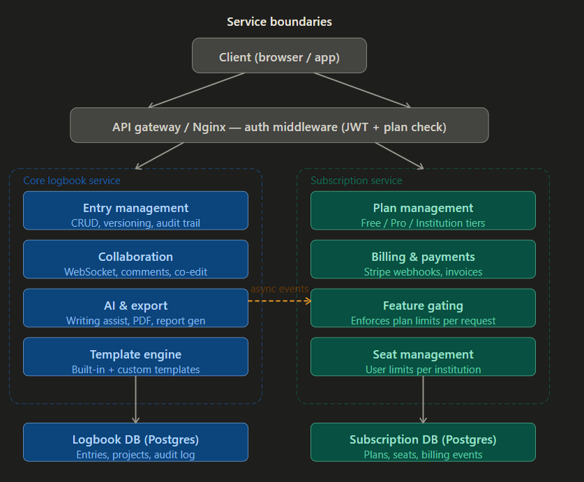

# OnlineLabNotebook
The Online Labnotebook is a web-based platform that provides engineering students and professional engineers with a centralised environment for documenting experiments, managing lab entries, collaborating in real time, and producing tamper-evident records. It eliminates the need to switch between word processors, PDF tools, email, and separate lab management systems by combining rich entry creation, project organisation, AI-assisted writing, compliance-ready export, and instructor workflows in a single interface.

---

## Problem Statement

### Problem Definition

Engineers and students working on lab and research projects face significant documentation and compliance overhead:

1. **Fragmented Documentation Tools:** Lab notes are spread across Word documents, PDFs, emails, and notebooks with no single place to track the full history of an experiment.

2. **Audit and Compliance Risk:** Manual timestamping and file-based records are not tamper-evident. Proving when work was documented is difficult without a proper audit trail.

3. **Collaboration Overhead:** Group experiments require emailing files, merging edits manually, and chasing missing sections — all outside the documentation tool itself.

4. **Instructor Review Friction:** Students export PDFs and email them to instructors. There is no structured submission, status tracking, or inline feedback mechanism.

5. **IP Documentation Gaps:** Professional engineers have no lightweight way to timestamp and flag novel findings as intellectual property disclosures within their workflow.

